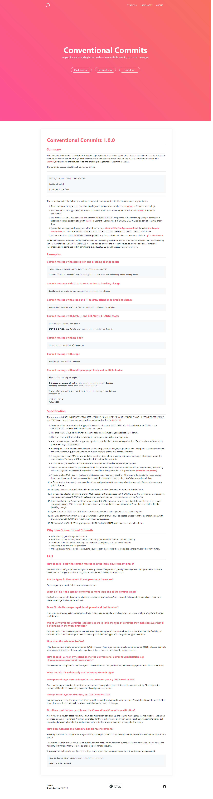

  

<h3 align="center">Nutrition Label</h3>

---

 Conventional Commits website Clone
     

## 📝 Table of Contents

- [About](#about)
- [Built Using](#built_using)
- [Authors](#authors)
- [Acknowledgments](#acknowledgement)

## 🧐 About 

Conventional Commits have a really neat, simple, yet, well designed website, so I decided to make a clone of it to practice and improve my web development skills. Thank you to Conventional Commits for this design, I don't pretend on it, just making a clone with no harm intended.

## 🚀 Deployment 

- [Live View](https://seesmof.github.io/conventional-commits-clone/)

## ⛏️ Built Using 

- [HTML](https://www.w3.org/html/) - Markup Language
- [CSS](https://www.w3schools.com/css/) - Styling Language
- [SASS](https://sass-lang.com/) - CSS Pre-Processor
- [Bootstrap](https://getbootstrap.com/) - CSS Framework

## ✍️ Authors 

- [@seesmof](https://github.com/seesmof) - Development
- [@conventional-commits](https://github.com/conventional-commits) - Idea & Desing

## 🎉 Acknowledgements 

- [@conventional-commits](https://github.com/conventional-commits) for great website design
